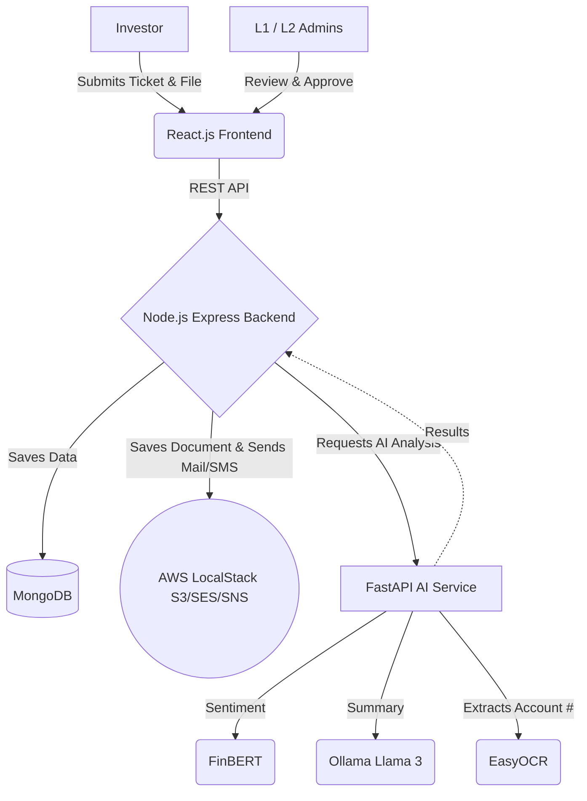

# 🚀 KFintech Nexus Portal

[](https://opensource.org/licenses/MIT)
[](https://www.docker.com/)
[](https://reactjs.org/)
[](https://nodejs.org/)
[](https://www.python.org/)
[](https://fastapi.tiangolo.com/)

Welcome to the **KFintech Nexus Portal**. This is an advanced, AI-driven investor grievance and ticket management system. It securely orchestrates ticket creation, AI-powered sentiment analysis and summarization, document OCR verification, and a multi-tiered (L1/L2) administrative approval workflow.

## 🌟 Key Features
- **Investor Dashboard:** Submit complaints and upload KYC/supporting documents seamlessly.
- **AI Triage (FinBERT & Ollama):** Automatically assigns priority and generates concise summaries based on the investor's text.
- **OCR Verification:** Automatically scans uploaded documents for matching account numbers using EasyOCR.
- **L1 Maker & L2 Checker:** Strict Maker-Checker governance. L1 administrators triage and review; L2 administrators grant final approval.
- **AWS LocalStack Integration:** A 100% free, localized environment for S3 (document storage), SES (email notifications), and SNS (SMS notifications).

---

## 🏗️ Architecture Stack

### High-Level Flow


### Frontend
- **React.js (Vite)** with TailwindCSS for a sleek, glassmorphic UI.
- React Router for dashboard navigation.

### Backend (Node.js Core)
- **Express.js** providing RESTful APIs.
- **MongoDB** with ACID transactions to strictly enforce Maker-Checker workflows and audit logs.
- AWS SDK (v3) configured against LocalStack for zero-cost S3, SES, and SNS execution.

### AI Microservice (Python)
- **FastAPI** serving dedicated AI pipelines.
- **FinBERT** for financial sentiment analysis.
- **EasyOCR** for extracting text from uploaded images.
- **Ollama (Llama 3.2)** for generating intelligent summaries of long complaints.

---

## 🚀 Getting Started

We use Docker Compose to completely containerize the application. **You do not need an AWS account, nor do you need to install Python or Node manually.**

### Prerequisites
1. [Docker](https://www.docker.com/products/docker-desktop) installed and running.
2. Ensure ports `5173` (Frontend), `5000` (Node), `8000` (Python AI), `27018` (MongoDB), `11434` (Ollama), and `4566` (LocalStack) are free.

### Running the Application (CPU Mode)
If you do not have a dedicated NVIDIA GPU, use the CPU configuration:

```bash
docker-compose -f docker-compose.cpu.yml up --build -d
```

### Running the Application (GPU Mode)
If you have an NVIDIA GPU and Docker configured to use it (nvidia-container-toolkit):

```bash
docker-compose up --build -d
```

---

## 🧪 Testing the Workflow

Once the containers are up and running, follow these steps to test the portal:

1. **Access the Portal:**
   Open your browser and navigate to `http://localhost:5173`.

2. **Submit a Ticket (Investor Role):**
   - Fill out the complaint form.
   - Upload a test image document.
   - Click submit. Behind the scenes, the document is sent to LocalStack S3, and the AI backend processes the sentiment and OCR data.

3. **L1 Maker Review:**
   - Go to the **L1 Maker Desk** in the navigation bar.
   - Locate the newly created ticket.
   - Review the AI summary, sentiment score, and OCR verification.
   - Move the ticket forward to L2 Approval.

4. **L2 Checker Approval & Notifications:**
   - Go to the **L2 Checker Desk**.
   - Approve or Reject the ticket.
   - *Check your terminal logs!* Run `docker logs kfintech_node_cpu` to see the LocalStack emulator firing off the SMS (SNS) and Email (SES) notifications!

---

## 🛑 Stopping the Environment

To stop the containers and free up resources, simply run:

```bash
docker-compose -f docker-compose.cpu.yml down
```
*(Remove `-f docker-compose.cpu.yml` if you used the GPU configuration).*

---

### Additional Notes for the Team
- **Database Persistence:** The `kfintech_mongo` container binds to a virtual network. If you tear down the volume, you will lose your historical ticket data.
- **LocalStack Persistence:** We are using LocalStack Community Edition (`v2.3.2`) to prevent accidental PRO-tier lockouts. All emails and SMS messages are mocked locally and will print to the Node service console.
