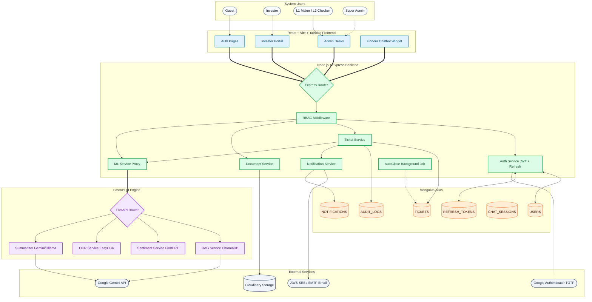
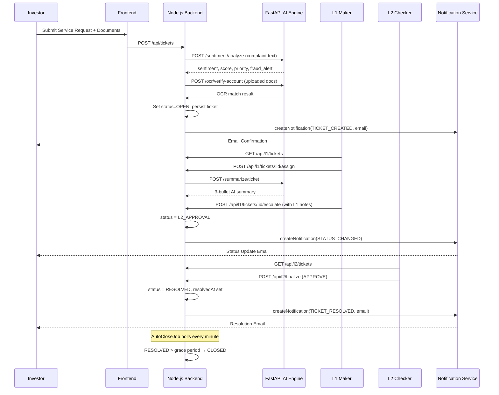
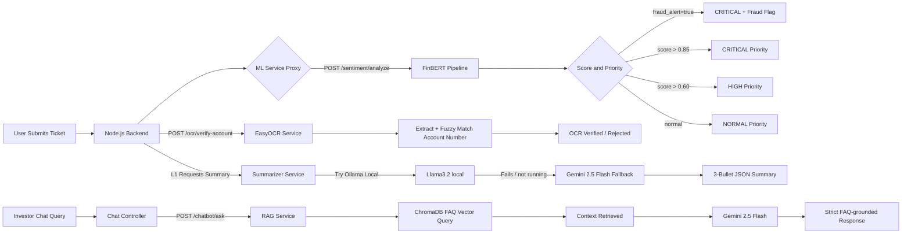
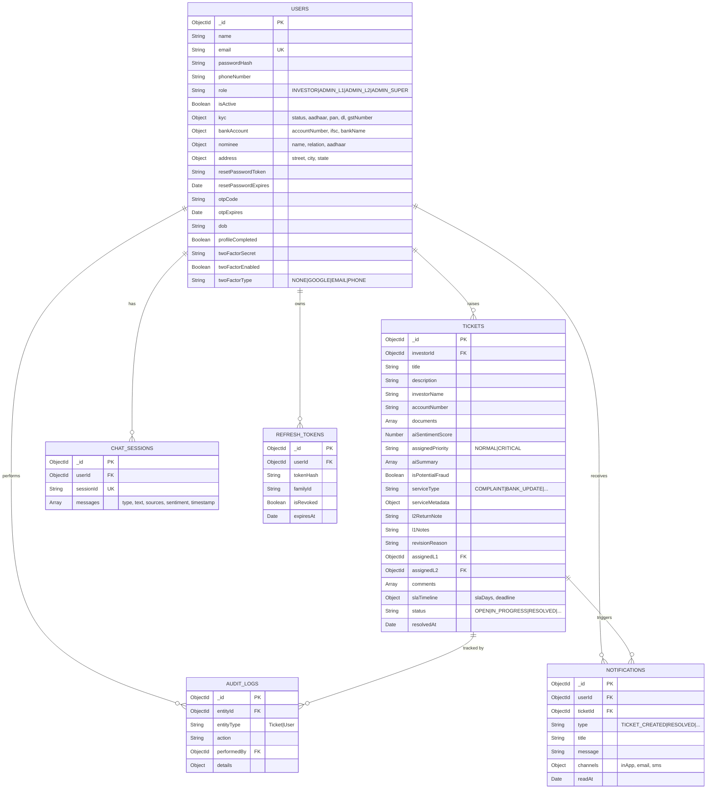
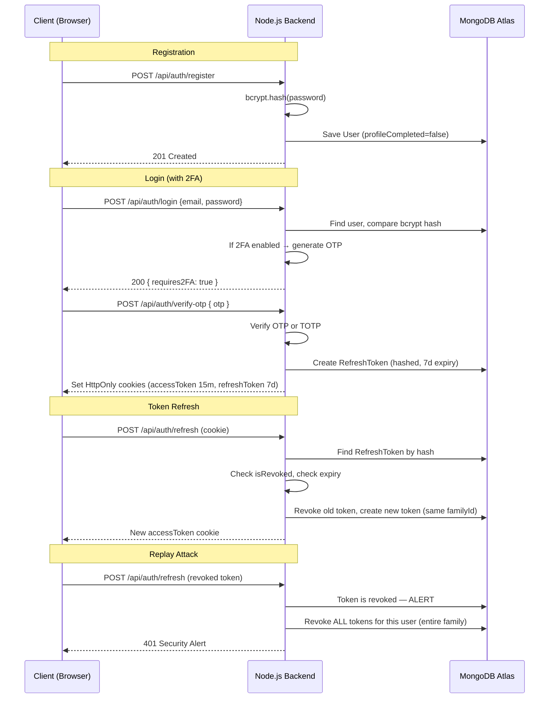

<div align="center">

<br/>

# FinnovaX

### Enterprise-Grade AI-Powered Investor Service Portal

*Digitizing and intelligently triaging investor service requests for financial institutions*

<br/>

[](https://nodejs.org/)
[](https://reactjs.org/)
[](https://fastapi.tiangolo.com/)
[](https://www.mongodb.com/atlas)
[](https://cloudinary.com/)
[](https://ai.google.dev/)
[](https://www.docker.com/)
[](https://vitejs.dev/)
[](https://tailwindcss.com/)
[](./LICENSE)
[](https://github.com/Swayam42/finnovaX)

<br/>

---

</div>

## 📌 Table of Contents

- [Project Overview](#-project-overview)
- [Business Perspective](#-business-perspective)
- [System Architecture](#-system-architecture)
- [Ticket Workflow](#-ticket-workflow)
- [AI Pipeline](#-ai-pipeline)
- [Features](#-features)
- [Technology Stack](#-technology-stack)
- [Database Design](#-database-design)
- [Folder Structure](#-folder-structure)
- [API Documentation](#-api-documentation)
- [Authentication Flow](#-authentication-flow)
- [Security](#-security)
- [Local Development](#-local-development)
- [Deployment](#-deployment)
- [Module-Wise Flow](#-module-wise-flow)
- [Business Walkthrough](#-business-walkthrough)
- [Future Enhancements](#-future-enhancements)
- [Contributing](#-contributing)
- [License](#-license)

---

## 🚀 Project Overview

**FinnovaX** is a production-grade, full-stack FinTech portal built for **KFintech-style mutual fund and investor service management**. It is designed to solve one of the most pressing operational challenges in asset management companies: **manual, error-prone, slow investor grievance and service request processing**.

### The Business Problem

Financial institutions process thousands of investor service requests daily — nominee changes, bank account updates, KYC document submissions, and formal complaints. Traditionally, this means:

- **Slow turnaround times** — Agents manually read long, emotional requests to categorize them
- **Compliance risk** — Critical or fraudulent requests get buried under routine tickets
- **Document errors** — Manual verification of KYC documents is slow and error-prone
- **No audit trail** — Changes happen without immutable, role-attributed records

### How FinnovaX Solves This

FinnovaX introduces **AI at every step** of the workflow:

1. **Intelligent Intake** — When an investor submits a complaint, FinBERT (a financial NLP model) analyzes the text for sentiment, fraud signals, and intent
2. **Automated Prioritization** — CRITICAL priority and fraud flags are applied automatically based on sentiment score and fraud keyword detection
3. **OCR Document Verification** — EasyOCR cross-references submitted KYC documents against the investor's declared information
4. **AI-Powered Summaries** — L1 agents receive a 3-bullet summary generated by Gemini/Ollama (hybrid approach) so they can triage in seconds instead of minutes
5. **Strict Maker-Checker Enforcement** — L1 makers can triage and escalate; only L2 checkers can finalize resolutions. No single actor can complete sensitive operations alone
6. **Intelligent Chatbot** — A strict RAG-based chatbot (Finnora) answers investor queries using ChromaDB as the knowledge base, never hallucinating beyond its trained FAQ data

### Who Uses It?

| Role | Description |
|------|-------------|
| **Investor** | Submits and tracks service requests |
| **L1 Maker** | Triages, assigns priority, escalates or rejects |
| **L2 Checker** | Provides final approval or returns to L1 |
| **Super Admin** | Monitors system KPIs, manages users, views audit logs |
| **Guest** | Can interact with Finnora chatbot before registration |

---

## 💼 Business Perspective

> *For investors, clients, and non-technical stakeholders*

### A Real-World Example: Investor Updates Bank Account

**Without FinnovaX:**
An investor calls the helpdesk. An agent takes notes manually. The request gets emailed to an operations team. Someone prints documents and physically verifies the cancelled cheque. If documents are incomplete, the investor is called back. Three to five business days later, maybe the update is done — or maybe it's lost in an email chain.

**With FinnovaX:**

1. Investor logs into the portal and selects **Bank Account Update** from the service menu
2. The system shows exactly what documents are needed (Cancelled Cheque + Passbook First Page), and enforces an SLA of 10 business days
3. Documents are uploaded — OCR immediately extracts and validates the account number
4. The AI analyzes the request text for urgency signals and assigns an initial priority
5. An L1 Maker reviews the request on their desk, sees the AI summary, verifies the OCR match, and escalates to L2 with notes
6. The L2 Checker reviews and finalizes — the investor immediately receives an email notification
7. Every action is recorded in an immutable AuditLog

**Result:** From 5 days and 3 phone calls to 10 business days guaranteed SLA with zero calls and full digital traceability.

### Service Types Supported

| Service | SLA | Documents Required |
|---------|-----|--------------------|
| `COMPLAINT` | 7 business days | None |
| `BANK_UPDATE` | 10 business days | Cancelled Cheque, Bank Passbook |
| `NOMINEE_UPDATE` | 7 business days | Nominee ID Proof, Photograph |
| `ADDRESS_UPDATE` | 7 business days | Address Proof, Declaration Letter |
| `EMAIL_UPDATE` | 2 business days | None |
| `MOBILE_UPDATE` | 2 business days | None |
| `KYC_UPDATE` | 15 business days | KYC Document, Passport Photo |

---

## 🏗 System Architecture



---

## 🔄 Ticket Workflow



### Ticket Status States

```
OPEN → IN_PROGRESS → L1_REVIEW → L2_APPROVAL → RESOLVED → CLOSED
                   ↘                          ↘
                    REJECTED               RETURNED TO L1
```

---

## 🤖 AI Pipeline



### AI Service Details

| Service | Model | Purpose | Fallback |
|---------|-------|---------|----------|
| **Sentiment Analysis** | `ProsusAI/finbert` | Detect sentiment, fraud, intent, and assign priority | Keyword-based scoring |
| **OCR Verification** | `EasyOCR` | Extract and fuzzy-match text from uploaded documents | Mock pass |
| **Summarizer** | Ollama `llama3.2:1b` → Gemini `2.5-flash` | Generate 3-bullet actionable summaries for L1 agents | Plain text fallback |
| **RAG Chatbot** | ChromaDB + Gemini `2.5-flash` | FAQ-grounded chatbot, strict context-only responses | None (transparent failure) |

---

## ✨ Features

<details>
<summary><strong>🧑‍💼 Investor Features</strong></summary>

- **Secure Registration & Login** with OTP email verification
- **Multi-Factor Authentication** — Google Authenticator TOTP or Email OTP
- **7 Service Request Types** with guided forms and document checklists
- **Real-time Ticket Tracking** with full status history
- **Document Upload** with Cloudinary storage and OCR verification feedback
- **In-App Notifications** with email delivery for important events
- **Ticket Comments** with visibility controls (investor-visible vs internal)
- **Profile Management** with KYC, bank, nominee, and address fields
- **Ticket Resubmission** after rejection
- **Finnora AI Chatbot** — interactive RAG-based support assistant

</details>

<details>
<summary><strong>🔧 L1 Maker Features</strong></summary>

- **Filtered Ticket Queue** — filter by status, priority, service type
- **Ticket Assignment** — claim ownership of a ticket
- **AI Summary Generation** — one-click Gemini/Ollama 3-bullet summary
- **Sentiment Score View** — see FinBERT confidence and fraud flags
- **Document OCR Trigger** — verify uploaded documents via EasyOCR
- **Escalate to L2** — with mandatory notes
- **Reject Ticket** — with mandatory rejection reason (triggers investor email)
- **Internal Comments** — visible only to admin staff

</details>

<details>
<summary><strong>✅ L2 Checker Features</strong></summary>

- **L2 Approval Queue** — exclusively `L2_APPROVAL` status tickets
- **Finalize Resolution** — approve and resolve (sends investor email)
- **Return to L1** — send back with a note if further action is needed
- **Full Ticket History** — view complete audit trail

</details>

<details>
<summary><strong>👑 Super Admin Features</strong></summary>

- **System KPI Dashboard** — total tickets, open, resolved, CRITICAL, fraud flagged
- **All Users Management** — activate/deactivate user accounts
- **All Tickets View** — with full filtering and pagination
- **Flagged Tickets** — dedicated view for CRITICAL + fraud tickets
- **CSV Report Export** — download ticket data for compliance reporting
- **Agent Activity Audit** — view every L1/L2 action chronologically
- **OCR Document Verification** — trigger manual document OCR

</details>

<details>
<summary><strong>🤖 AI Features</strong></summary>

- **FinBERT Sentiment Analysis** — financial-domain NLP for real sentiment detection
- **Fraud Signal Detection** — keyword-based fraud alert with priority override
- **EasyOCR Extraction** — GPU or CPU-accelerated document text extraction
- **Account Number Fuzzy Matching** — tolerates minor OCR character recognition errors
- **KYC Name + DOB Matching** — validates identity against government-issued ID
- **Gemini 2.5 Flash Integration** — cloud LLM for summaries and chatbot responses
- **Ollama Local Fallback** — security-first local LLM for offline/on-premise deployments
- **ChromaDB RAG** — persistent vector store seeded with FinnovaX FAQ content
- **Strict Chatbot Context** — L2 distance threshold (< 1.1) ensures no hallucination beyond KB

</details>

<details>
<summary><strong>🔐 Security Features</strong></summary>

- **JWT Access Tokens** (15-minute expiry)
- **Rotating Refresh Tokens** (7-day expiry, SHA-256 hashed in DB)
- **Token Replay Attack Detection** — reused refresh tokens trigger full session revocation
- **Google Authenticator TOTP** (speakeasy library, ±30s clock drift tolerance)
- **Email OTP 2FA** as alternative
- **Helmet.js** — HTTP security headers
- **Rate Limiting** — 5000 req/15min globally, 10 attempts/15min for login
- **CORS Whitelist** — only approved domains
- **MongoDB Sanitize** — NoSQL injection prevention
- **Role-Based Access Control** — strict per-route role enforcement

</details>

<details>
<summary><strong>🏗 Infrastructure Features</strong></summary>

- **Docker Compose** — full containerized deployment (GPU and CPU variants)
- **MongoDB Atlas** — cloud-managed database with compound indexes
- **Cloudinary** — media/document storage with CDN delivery
- **AWS LocalStack** — S3/SES/SNS emulation for local development
- **AutoClose Background Job** — automatically closes `RESOLVED` tickets after grace period
- **ChromaDB Seeding** — FAQ knowledge base auto-seeded on FastAPI startup
- **Health Endpoints** — `/health` on Node.js and `/health` on FastAPI

</details>

---

## 🛠 Technology Stack

### Frontend

| Technology | Version | Purpose |
|-----------|---------|---------|
| React | 18 | UI Framework |
| Vite | Latest | Build Tool & Dev Server |
| Tailwind CSS | 3 | Utility-First Styling |
| shadcn/ui | Latest | Component Library |
| Framer Motion | Latest | Animations & Transitions |
| React Router DOM | 6 | Client-Side Routing |
| Lucide React | Latest | Icon System |
| Recharts | Latest | Analytics Charts |
| Sonner | Latest | Toast Notifications |
| date-fns | Latest | Date Formatting |
| Axios | Latest | HTTP Client |

### Backend (Node.js)

| Technology | Version | Purpose |
|-----------|---------|---------|
| Node.js | 18+ | Runtime |
| Express.js | 4 | Web Framework |
| Mongoose | 8 | MongoDB ODM |
| JWT (jsonwebtoken) | 9 | Access Token Generation |
| bcrypt | 6 | Password Hashing |
| speakeasy | 2 | TOTP 2FA |
| qrcode | 1.5 | QR Code Generation for 2FA |
| otplib | 13 | OTP Support |
| Multer | 1.4 | File Upload Middleware |
| Cloudinary SDK | 2 | Document Storage |
| Helmet | 8 | HTTP Security Headers |
| express-rate-limit | 8 | Rate Limiting |
| express-mongo-sanitize | 2 | NoSQL Injection Prevention |
| AWS SDK v3 | 3 | S3/SES/SNS LocalStack Integration |
| nodemailer | 9 | SMTP Email Delivery |
| Resend | 6 | Alternative Email Provider |
| Twilio | 6 | SMS Notifications |
| Axios | 1.6 | ML Service HTTP Proxy |
| cookie-parser | 1.4 | Cookie Handling |
| dotenv | 16 | Environment Configuration |

### AI Engine (Python/FastAPI)

| Technology | Purpose |
|-----------|---------|
| FastAPI | AI Microservice Framework |
| uvicorn | ASGI Server |
| transformers (HuggingFace) | FinBERT Sentiment Model |
| PyTorch | GPU/CPU Inference |
| EasyOCR | Document Text Extraction |
| ChromaDB | RAG Vector Store |
| google-genai | Gemini 2.5 Flash API |
| httpx | Async HTTP Client (Ollama) |
| python-dotenv | Environment Configuration |

### Infrastructure & Cloud

| Service | Purpose |
|---------|---------|
| MongoDB Atlas | Primary Database |
| Cloudinary | Document/Media Storage |
| Google Gemini API | Cloud LLM |
| Ollama (local) | On-Premise LLM (hybrid) |
| AWS SES (LocalStack) | Email Delivery (Dev) |
| AWS SNS (LocalStack) | SMS Delivery (Dev) |
| AWS S3 (LocalStack) | File Storage (Dev) |
| Docker Compose | Container Orchestration |

---

## 🗄 Database Design

### Collections Overview



### Collection Details

<details>
<summary><strong>USERS</strong></summary>

**Purpose:** Central identity store for all system actors — investors, L1/L2 agents, and super admins.

**Key Indexes:**
- `email` — unique, used for login lookups
- `role` — used to filter admin desks
- `role + isActive` — used for agent performance queries

**Notable Fields:**
- `twoFactorSecret` — selected with `+twoFactorSecret` only when needed (never returned by default)
- `passwordHash` — `select: false` (never returned in API responses)
- `refreshTokens` — legacy array, replaced by `RefreshToken` model
- `profileCompleted` — gates investor dashboard access and triggers profile completion toast

</details>

<details>
<summary><strong>TICKETS</strong></summary>

**Purpose:** The core entity. Each service request is a ticket with a lifecycle from `OPEN` to `CLOSED`.

**Lifecycle:** `OPEN → IN_PROGRESS → L1_REVIEW → L2_APPROVAL → RESOLVED → CLOSED`

**Key Indexes:**
- `{ investorId, createdAt }` — Investor's personal ticket list
- `{ status, createdAt }` — L1 queue rendering
- `{ assignedL1, status }` — L1 "my assigned tickets" filter
- `{ isPotentialFraud }` — Admin fraud dashboard
- `{ slaTimeline.deadline, status }` — future SLA breach scanning
- `{ status, resolvedAt }` — AutoCloseJob

**Notable Fields:**
- `documents[].ocrExtraction` — stores `extractedText`, `matchVerified`, and `confidence` after OCR
- `comments[].visibility` — `'INVESTOR_ADMIN'` or `'INTERNAL'` to hide agent notes from investors
- `aiSummary` — array of strings, generated by Gemini/Ollama per L1 request

</details>

<details>
<summary><strong>AUDIT_LOGS</strong></summary>

**Purpose:** Immutable, role-attributed record of every consequential action on the platform.

Every L1 escalation, L2 approval, rejection, and auto-close is written here. The Super Admin agent activity view queries this collection.

</details>

<details>
<summary><strong>NOTIFICATIONS</strong></summary>

**Purpose:** Stores every in-app notification. Triggers real-time email delivery for `TICKET_CREATED`, `TICKET_RESOLVED`, `TICKET_REJECTED`, `DOCUMENT_REJECTED`, and `STATUS_CHANGED` events.

**Email Templates:** Fully HTML-styled branded emails for each notification type, sent via AWS SES (LocalStack) or SMTP (Nodemailer).

</details>

<details>
<summary><strong>CHAT_SESSIONS</strong></summary>

**Purpose:** Persists chatbot conversation history. Supports both authenticated users (keyed by `userId`) and anonymous guests (keyed by `sessionId` from `localStorage`).

</details>

<details>
<summary><strong>REFRESH_TOKENS</strong></summary>

**Purpose:** Secure storage for rotating refresh tokens. Each token is stored as a SHA-256 hash, never the raw value. Contains a `familyId` to detect and respond to replay attacks by revoking all tokens in the same session family.

</details>

---

## 📁 Folder Structure

```
kfintech-nexus-portal/
│
├── frontend/                      # React + Vite application
│   └── src/
│       ├── api/
│       │   └── client.js          # Axios instance with auth interceptors
│       ├── components/
│       │   ├── admin/             # Admin-specific UI components
│       │   │   ├── StatCard.jsx   # KPI metric cards
│       │   │   ├── DashboardHeader.jsx
│       │   │   └── DashboardToolbar.jsx
│       │   ├── common/
│       │   │   ├── ChatbotWidget.jsx   # Finnora chatbot (cursor-tracking eyes, sound FX)
│       │   │   ├── Sidebar.jsx
│       │   │   └── ThemeToggle.jsx    # Dark/light ripple effect toggle
│       │   ├── investor/
│       │   │   ├── CreateTicketFlow.jsx   # 7-step guided ticket creation wizard
│       │   │   ├── MyTickets.jsx          # Ticket list with filters
│       │   │   ├── TicketDetail.jsx       # Full ticket + timeline view
│       │   │   ├── Profile.jsx            # Investor profile + KYC management
│       │   │   ├── Documents.jsx          # Document upload + Cloudinary
│       │   │   ├── NotificationsView.jsx  # In-app notification center
│       │   │   └── ProfileCompletionModal.jsx
│       │   └── ui/                # shadcn/ui components + custom animations
│       ├── config/
│       │   └── serviceTypes.js    # Service request configuration (SLA, fields, documents)
│       ├── context/
│       │   ├── AuthContext.jsx    # JWT auth state, user role management
│       │   └── ThemeContext.jsx   # Dark/Light theme persistence
│       ├── pages/
│       │   ├── auth/
│       │   │   ├── LoginPage.jsx
│       │   │   ├── RegisterPage.jsx
│       │   │   └── ForgotPasswordPage.jsx
│       │   ├── InvestorDashboard.jsx
│       │   ├── L1MakerDesk.jsx    # Full L1 triage dashboard
│       │   ├── L2CheckerDesk.jsx  # L2 approval dashboard
│       │   ├── AdminDashboard.jsx # Super Admin metrics + management
│       │   ├── LandingPage.jsx
│       │   └── ProfilePage.jsx
│       └── App.jsx                # Root routing with RBAC route guards
│
├── node_service/                  # Node.js + Express backend
│   ├── controllers/
│   │   ├── auth/
│   │   │   ├── login.controller.js      # OTP-verified login
│   │   │   ├── register.controller.js
│   │   │   ├── session.controller.js    # JWT refresh, logout, /me
│   │   │   ├── password.controller.js   # Forgot/reset/change password
│   │   │   ├── profile.controller.js    # Profile update + document upload
│   │   │   └── twoFactor.controller.js  # TOTP + Email 2FA
│   │   ├── l1.controller.js        # Queue, assign, escalate, reject, summarize
│   │   ├── l2.controller.js        # L2 queue, finalize resolution
│   │   ├── admin.controller.js     # Metrics, users, all tickets, exports
│   │   ├── ticket.controller.js    # Create, get, comment, OCR, sentiment, resubmit
│   │   ├── chat.controller.js      # Chatbot session management + proxy
│   │   ├── dashboard.controller.js # Investor dashboard stats
│   │   └── notification.controller.js
│   ├── middleware/
│   │   └── auth.middleware.js      # authenticate, authorize, optionalAuthenticate
│   ├── models/
│   │   ├── User.js
│   │   ├── Ticket.js
│   │   ├── AuditLog.js
│   │   ├── Notification.js
│   │   ├── ChatSession.js
│   │   └── RefreshToken.js
│   ├── routes/
│   │   ├── auth.routes.js
│   │   ├── ticket.routes.js
│   │   ├── l1.routes.js
│   │   ├── l2.routes.js
│   │   ├── admin.routes.js
│   │   ├── chat.routes.js
│   │   ├── dashboard.routes.js
│   │   └── notification.routes.js
│   ├── services/
│   │   ├── auth/
│   │   │   ├── token.service.js    # JWT + Refresh token generation + rotation
│   │   │   ├── password.service.js # bcrypt hash + compare
│   │   │   ├── otp.service.js      # OTP generation + email delivery
│   │   │   ├── cookie.service.js   # Secure cookie setter
│   │   │   └── user.service.js     # Public profile builder
│   │   ├── mlService.js            # ML proxy: sentiment, OCR, summarize
│   │   ├── notificationService.js  # In-app + email + SMS notifications
│   │   ├── autoCloseService.js     # Background job: RESOLVED → CLOSED
│   │   ├── sesService.js           # AWS SES email delivery
│   │   ├── snsService.js           # AWS SNS SMS delivery
│   │   └── s3Service.js            # AWS S3 file operations
│   └── server.js
│
├── backend/                       # Python FastAPI AI Engine
│   └── app/
│       ├── main.py                # FastAPI app factory, startup events
│       ├── routes/
│       │   ├── sentiment.py       # POST /sentiment/analyze
│       │   ├── ocr.py             # POST /ocr/verify-account, /ocr/verify-kyc
│       │   ├── chatbot.py         # POST /chatbot/ask
│       │   ├── summarizer.py      # POST /summarize/ticket
│       │   └── health.py          # GET /health
│       └── services/
│           ├── sentiment_service.py  # FinBERT pipeline + fraud detection
│           ├── ocr_service.py        # EasyOCR + fuzzy matching
│           ├── rag_service.py        # ChromaDB vector query
│           ├── llm_service.py        # Gemini + Ollama hybrid LLM
│           └── knowledge_base.py     # ChromaDB FAQ seeding
│
├── docker-compose.yml             # GPU-accelerated full stack
├── docker-compose.cpu.yml         # CPU-only variant
└── README.md
```

---

## 📡 API Documentation

### Authentication APIs — `/api/auth`

| Method | Endpoint | Auth | Purpose |
|--------|----------|------|---------|
| `POST` | `/register` | None | Register new investor account |
| `POST` | `/login` | None | Initiate login (sends OTP if 2FA enabled) |
| `POST` | `/verify-otp` | None | Verify OTP to complete login |
| `POST` | `/refresh` | Cookie | Rotate refresh token, get new access token |
| `POST` | `/logout` | Cookie | Revoke refresh token, clear cookies |
| `GET` | `/me` | JWT | Get authenticated user profile |
| `POST` | `/forgot-password` | None | Send password reset email |
| `POST` | `/reset-password` | Token | Set new password via reset token |
| `POST` | `/change-password` | JWT | Change password when logged in |
| `PUT` | `/profile` | JWT | Update name, phone, address, bank, nominee, DOB |
| `POST` | `/profile/documents` | JWT | Upload KYC documents (Cloudinary) |
| `DELETE` | `/profile/documents/:docType` | JWT | Remove a KYC document |
| `POST` | `/2fa/generate` | JWT | Generate TOTP secret + QR code URL |
| `POST` | `/2fa/verify` | JWT | Verify TOTP token to enable Google Authenticator |
| `POST` | `/2fa/email/generate` | JWT | Send OTP to email for Email 2FA setup |
| `POST` | `/2fa/email/verify` | JWT | Verify email OTP to enable Email 2FA |

<details>
<summary><strong>Example: POST /api/auth/register</strong></summary>

**Request Body:**
```json
{
  "name": "Priya Sharma",
  "email": "priya@example.com",
  "password": "SecurePass123!",
  "phoneNumber": "+919876543210"
}
```

**Response (201):**
```json
{
  "message": "Registration successful.",
  "user": {
    "_id": "6683abc...",
    "name": "Priya Sharma",
    "email": "priya@example.com",
    "role": "INVESTOR",
    "profileCompleted": false
  }
}
```
</details>

---

### Ticket APIs — `/api/tickets`

| Method | Endpoint | Auth | Purpose |
|--------|----------|------|---------|
| `POST` | `/` | JWT (Investor/Admin) | Create new service request ticket |
| `GET` | `/` | JWT | Get tickets for logged-in user |
| `POST` | `/sentiment` | JWT (Investor/L1/L2/Admin) | Preview sentiment analysis before submission |
| `GET` | `/:id` | JWT | Get ticket + timeline details |
| `POST` | `/:id/comments` | JWT | Add comment to ticket |
| `POST` | `/:id/resubmit` | JWT | Resubmit a rejected ticket |
| `POST` | `/:id/documents/:docId/ocr` | JWT (L1/Admin) | Run OCR verification on a document |

---

### L1 Maker APIs — `/api/l1`

| Method | Endpoint | Auth | Purpose |
|--------|----------|------|---------|
| `GET` | `/tickets` | JWT (L1/Admin) | Get L1 queue with filters |
| `POST` | `/tickets/:id/assign` | JWT (L1/Admin) | Assign ticket to current user |
| `POST` | `/tickets/:id/escalate` | JWT (L1/Admin) | Escalate to L2 with notes |
| `POST` | `/tickets/:id/reject` | JWT (L1/Admin) | Reject with reason |
| `POST` | `/tickets/:id/summarize` | JWT (L1/Admin) | Generate AI summary via Gemini/Ollama |

---

### L2 Checker APIs — `/api/l2`

| Method | Endpoint | Auth | Purpose |
|--------|----------|------|---------|
| `GET` | `/tickets` | JWT (L2/Admin) | Get L2 approval queue |
| `POST` | `/finalize` | JWT (L2/Admin) | Approve (resolve) or return to L1 |

<details>
<summary><strong>Example: POST /api/l2/finalize</strong></summary>

**Request Body:**
```json
{
  "ticketId": "6683abc...",
  "action": "APPROVE",
  "notes": "Bank account verified. Documents are authentic. Approved."
}
```

**Response (200):**
```json
{
  "message": "Ticket resolved successfully.",
  "ticket": { "status": "RESOLVED", "resolvedAt": "2025-06-30T..." }
}
```
</details>

---

### Admin APIs — `/api/admin`

| Method | Endpoint | Auth | Purpose |
|--------|----------|------|---------|
| `POST` | `/verify-document` | JWT (L1/Admin) | Manual OCR document verification |
| `PUT` | `/escalate/:id` | JWT (L1/Admin) | Escalate via admin panel |
| `PUT` | `/reject/:id` | JWT (L1/Admin) | Reject via admin panel |
| `GET` | `/metrics` | JWT (Admin) | System KPIs — totals, trends |
| `GET` | `/users` | JWT (Admin) | All users list |
| `PUT` | `/users/:id/status` | JWT (Admin) | Activate / deactivate user |
| `GET` | `/tickets` | JWT (Admin) | All tickets with filters |
| `GET` | `/tickets/flagged` | JWT (Admin) | Fraud + CRITICAL tickets |
| `GET` | `/reports/export` | JWT (Admin) | CSV report download |
| `GET` | `/agents/activities` | JWT (Admin) | Audit trail for all agents |

---

### Chatbot APIs — `/api/chat`

| Method | Endpoint | Auth | Session |
|--------|----------|------|---------|
| `GET` | `/history` | Optional | `x-session-id` header |
| `POST` | `/ask` | Optional | `x-session-id` header |

> **Note:** The chatbot accepts an `x-session-id` header for anonymous guest sessions. Authenticated users are identified by their JWT `userId`. This allows Finnora to be accessible on the Login and Register pages before account creation.

---

### FastAPI AI Endpoints — `http://localhost:8000`

| Method | Endpoint | Purpose |
|--------|----------|---------|
| `POST` | `/sentiment/analyze` | Analyze text for sentiment, priority, fraud |
| `POST` | `/ocr/verify-account` | OCR + account number fuzzy match |
| `POST` | `/ocr/verify-kyc` | OCR + name + DOB KYC match |
| `POST` | `/summarize/ticket` | Generate 3-bullet ticket summary |
| `POST` | `/chatbot/ask` | RAG chatbot query |
| `GET` | `/health` | Health check |
| `GET` | `/docs` | FastAPI Swagger UI |

---

## 🔐 Authentication Flow



### RBAC Middleware

Every protected route passes through two middleware layers:

1. **`authenticate`** — verifies the JWT access token, attaches `req.user = { id, role }`
2. **`authorize(...roles)`** — checks `req.user.role` is in the allowed list, returns 403 if not

```
POST /api/l2/finalize
  → authenticate → authorize('ADMIN_L2', 'ADMIN_SUPER') → l2Controller.finalizeTicket
```

---

## 🛡 Security

| Layer | Implementation |
|-------|---------------|
| **Passwords** | bcrypt with salt rounds (never stored plaintext) |
| **Access Tokens** | JWT, 15-minute expiry, signed with `JWT_SECRET` |
| **Refresh Tokens** | SHA-256 hashed in DB, 7-day expiry, family-based replay detection |
| **2FA — TOTP** | speakeasy TOTP with ±1 window (30s clock tolerance) |
| **2FA — Email** | bcrypt-hashed OTP stored in DB, 5-minute expiry |
| **HTTP Headers** | Helmet.js — X-Frame-Options, CSP, HSTS, etc. |
| **Rate Limiting** | 5000 req/15min global; 10 login attempts/15min |
| **CORS** | Whitelist: `localhost:5173`, `*.vercel.app`, `FRONTEND_URL` env |
| **NoSQL Injection** | express-mongo-sanitize on all request bodies |
| **Secrets** | All secrets in `.env`, never committed |
| **File Uploads** | Multer handles in-memory, forwarded to Cloudinary (no local disk writes) |
| **RBAC** | Per-route role enforcement via `authorize()` middleware |

---

## 💻 Local Development

### Prerequisites

- Node.js 18+
- Python 3.11+
- Docker Desktop (optional, for LocalStack)
- MongoDB Atlas account (or local MongoDB)
- Cloudinary account
- Google Gemini API key

### 1. Clone the Repository

```bash
git clone https://github.com/Swayam42/finnovaX.git
cd finnovaX
```

### 2. Frontend Setup

```bash
cd frontend
npm install
cp .env.example .env.local
# Set VITE_API_URL=http://localhost:5000/api
npm run dev
# → http://localhost:5173
```

### 3. Node.js Backend Setup

```bash
cd node_service
npm install
cp .env.example .env
```

Edit `.env`:
```env
PORT=5000
NODE_ENV=development
MONGODB_URI=mongodb+srv://<user>:<pass>@cluster.mongodb.net/finnovax
JWT_SECRET=your_super_secret_key
JWT_REFRESH_SECRET=another_secret_key
FRONTEND_URL=http://localhost:5173

# Cloudinary
CLOUDINARY_URL=cloudinary://<api_key>:<api_secret>@<cloud_name>

# Email (SMTP via Gmail)
SMTP_USER=your_gmail@gmail.com
SMTP_PASS=your_gmail_app_password

# AI Engine
ML_SERVICE_URL=http://127.0.0.1:8000
```

```bash
npm run dev
# → http://localhost:5000
```

### 4. FastAPI AI Engine Setup

```bash
cd backend
python -m venv venv
# Windows:
venv\Scripts\activate
# macOS/Linux:
source venv/bin/activate

pip install -r requirements.txt
cp .env.example .env
```

Edit `backend/.env`:
```env
GEMINI_API_KEY=your_gemini_api_key
# Optional: OLLAMA_URL=http://localhost:11434/api/generate
```

```bash
uvicorn app.main:app --reload --port 8000
# → http://localhost:8000
# → Swagger Docs at http://localhost:8000/docs
```

### 5. (Optional) Docker Full Stack

**GPU Mode:**
```bash
docker-compose up --build -d
```

**CPU Mode (no NVIDIA GPU):**
```bash
docker-compose -f docker-compose.cpu.yml up --build -d
```

### 6. Seed Demo Data

```bash
# Creates default users (Investor, L1, L2, Admin) in MongoDB
node node_service/seed_user.js
```

Default credentials after seeding:
| Role | Email | Password |
|------|-------|----------|
| Investor | `investor@finnovax.com` | `Test@1234` |
| L1 Maker | `l1@finnovax.com` | `Test@1234` |
| L2 Checker | `l2@finnovax.com` | `Test@1234` |
| Super Admin | `admin@finnovax.com` | `Test@1234` |

---

## 🚀 Deployment

### Frontend (Vercel)

```bash
# In /frontend directory
npm run build
# Deploy dist/ to Vercel
```

**Environment Variables (Vercel):**
```
VITE_API_URL=https://your-backend.onrender.com/api
```

### Backend (Render / Railway)

1. Point to `node_service/` as the root
2. Build command: `npm install`
3. Start command: `node server.js`

**Environment Variables:** All vars from `.env.example` + production values

### FastAPI AI Engine (Render)

1. Point to `backend/` as the root
2. Build command: `pip install -r requirements.txt`
3. Start command: `uvicorn app.main:app --host 0.0.0.0 --port 8000`
4. Set `GEMINI_API_KEY` environment variable

### MongoDB Atlas

- Create a free M0 cluster
- Whitelist your deployment IPs
- Create a DB user with read/write access
- Copy the connection URI to `MONGODB_URI`

### Cloudinary

- Create a free Cloudinary account
- Copy `CLOUDINARY_URL` from dashboard

### Production Checklist

- [ ] `NODE_ENV=production` is set
- [ ] `JWT_SECRET` is a cryptographically random 64+ character string
- [ ] `MONGODB_URI` points to Atlas production cluster
- [ ] CORS `FRONTEND_URL` matches your Vercel deployment URL
- [ ] `GEMINI_API_KEY` is valid and has quota
- [ ] `SMTP_USER` and `SMTP_PASS` are valid for email delivery
- [ ] Cloudinary credentials are set

---

## 📖 Module-Wise Flow

### 1. Landing Page
A glassmorphism-styled marketing page with animated marquees, feature highlights, and CTAs for registration. The `Finnora` chatbot widget is visible here — guests can ask questions before creating an account.

### 2. Registration
- Investor fills in name, email, password, and phone number
- Account is created with `profileCompleted: false` and `role: 'INVESTOR'`
- On first login, a `ProfileCompletionModal` is displayed blocking navigation until the investor completes their KYC, bank, and nominee details

### 3. Authentication
- Two-step: credentials check → OTP or TOTP verification
- JWT access token (15m) stored in `HttpOnly` cookie
- Refresh token (7d) stored in `HttpOnly` cookie
- `AuthContext` on the frontend hydrates user state from `/api/auth/me`

### 4. Investor Dashboard
A `SidebarProvider` layout with four views: **My Tickets**, **Create Ticket**, **Profile & KYC**, and **Documents**. The DotBackground animated pattern provides visual depth.

### 5. Ticket Creation
`CreateTicketFlow.jsx` — a multi-step wizard:
1. **Step 1:** Select service type (7 options, each with SLA and document requirements)
2. **Step 2:** Fill in service-specific form fields (validated per service type)
3. **Step 3:** Write description and title
4. **Step 4:** Upload required documents
5. **Step 5:** Live sentiment preview (calls `/api/tickets/sentiment` before submitting)
6. **Step 6:** Confirm and submit

### 6. AI Analysis at Submission
When the ticket is submitted via `POST /api/tickets`:
1. Backend calls `mlService.analyzeSentiment(description)` → FinBERT assigns sentiment + priority
2. If documents uploaded, `mlService.verifyAccount(doc, accountNumber)` → EasyOCR validates
3. If fraud keywords detected (`hacked`, `stolen`, etc.) → `isPotentialFraud: true` + `CRITICAL`
4. Notification sent to investor with styled HTML email

### 7. L1 Maker Desk
L1 agents see a paginated, filterable queue of `OPEN`, `IN_PROGRESS`, and `L1_REVIEW` tickets.
- Click a ticket → see sentiment score, fraud flag, OCR result, documents
- Click **"Get AI Summary"** → backend calls Gemini/Ollama, renders 3 bullets
- **Assign to me** → `status: IN_PROGRESS`
- **Escalate** → `status: L2_APPROVAL`, every action logged in `AuditLog`
- **Reject** → `status: REJECTED`, investor receives rejection email with reason

### 8. L2 Checker Desk
Exclusively shows `L2_APPROVAL` tickets. The L2 checker cannot modify tickets — only:
- **Approve (Finalize)** → `status: RESOLVED`, `resolvedAt` set, investor receives resolution email
- **Return to L1** → `status: IN_PROGRESS`, `l2ReturnNote` stored, L1 notified

### 9. AutoClose Job
A background `setInterval` running every 60 seconds checks for `RESOLVED` tickets older than the grace period. When found, it atomically updates status to `CLOSED` and creates an `AuditLog` entry with `action: 'SYSTEM_AUTO_CLOSED'`.

### 10. Super Admin Dashboard
Tabbed interface with:
- **Overview** — KPI StatCards (open, resolved, critical, fraud)
- **Tickets** — filterable all-ticket view with flagged view
- **Users** — user management, activate/deactivate
- **Reports** — CSV export
- **Agent Activity** — chronological audit trail for all L1/L2 actions

### 11. Finnora Chatbot
- Floating widget accessible globally (all pages including Login/Register)
- Interactive SVG eyes track cursor movement, blink randomly
- Eyes close when a password field is focused anywhere on the page
- When opened, loads chat history via `GET /api/chat/history` (uses `x-session-id` for guests)
- Messages rendered in WhatsApp-style bubbles with SVG tails
- Sound effects (Web Audio API) on send and receive
- Suggested questions displayed for new sessions

---

## 💡 Business Walkthrough

### Example 1: Bank Account Update

**Actor:** Investor Priya wants to update her bank account.

1. Logs into FinnovaX portal
2. Creates a ticket: **Bank Account Update**
3. Fills in new bank details: HDFC Bank, account number `123456789`, IFSC `HDFC0001234`
4. Uploads: Cancelled Cheque image + Bank Passbook scan
5. System runs OCR on the cheque → extracts account number `123456789` → **match verified**
6. Ticket submitted (OPEN). Priya receives confirmation email.
7. L1 Maker Rakesh assigns the ticket to himself
8. Requests AI summary → Gemini returns: *"Investor requests bank update to HDFC. Documents provided. OCR match confirmed. Standard review required."*
9. Escalates to L2 with note: *"Documents verified via OCR. Recommend approval."*
10. L2 Checker Anjali reviews and clicks **Approve**
11. Priya receives email: "Good News! Your ticket has been resolved. 🎉"

**SLA Commitment:** 10 business days

---

### Example 2: Fraud Detection in Action

**Actor:** Investor submits a complaint with the description:

> *"Someone hacked into my account and I think my funds were stolen. Please help urgently. I will contact the police."*

1. Backend calls FinBERT → `NEGATIVE` sentiment, score `0.94`
2. Keyword scan → `hacked`, `stolen` detected → `isPotentialFraud: true`
3. Priority overridden to `CRITICAL` regardless of model score
4. Ticket appears at the top of L1 queue with a red **⚠️ FRAUD ALERT** badge
5. L1 agent is immediately notified and can escalate with urgency

---

### Example 3: Ticket Rejected and Resubmitted

1. Investor submits KYC Update without uploading a clear front scan
2. L1 Maker rejects with note: *"KYC document is blurry. Please resubmit with a clear scan."*
3. Investor receives rejection email with the rejection reason in a styled red block
4. Investor logs in, views the rejected ticket, and clicks **Resubmit**
5. Uploads a new, clear document
6. Ticket re-enters the L1 queue with status `L1_REVIEW`

---

### Example 4: Guest Uses Chatbot

**Actor:** Anjali is considering opening an investment account and visits the portal.

1. Lands on the homepage — sees Finnora chatbot widget in the corner (eyes watching cursor)
2. Clicks the widget → gets a welcome message
3. Clicks suggested question: *"What is the SLA for a KYC update?"*
4. Finnora queries ChromaDB → finds relevant FAQ → constructs answer via Gemini
5. Responds: *"KYC update requests have an SLA of 15 business days from the date of submission..."*
6. Anjali is confident and registers

---

## 🔮 Future Enhancements

| Feature | Description |
|---------|-------------|
| **Email OTP Login** | Remove TOTP dependency, use magic link for mobile-first experience |
| **Real-time Notifications** | WebSocket or SSE push for live ticket status updates |
| **SLA Breach Alerts** | Cron job to email agents when SLA deadline is approaching |
| **Mobile App** | React Native companion app for investors |
| **Fraud Score Dashboard** | Visual analytics on fraud patterns by region/service type |
| **Bulk Document Processing** | OCR batch processing for high-volume periods |
| **Agent Performance Analytics** | Turnaround time metrics per L1/L2 agent |
| **Multi-tenancy** | Support multiple financial institutions on the same platform |
| **Localization** | Hindi, Tamil, and regional language support |
| **WhatsApp Integration** | Ticket status updates via WhatsApp Business API |

---

## 🤝 Contributing

We welcome contributions! Please follow these guidelines:

### Branch Strategy

```
main          — Production-ready code only
develop       — Integration branch
feature/xyz   — New features
fix/xyz       — Bug fixes
chore/xyz     — Tooling, deps, config
```

### Commit Conventions

```
feat: Add OCR fuzzy matching for KYC documents
fix: Resolve 403 on L1 sentiment endpoint
chore: Update Gemini SDK to 0.2.0
docs: Add API documentation for chatbot routes
refactor: Extract token rotation to separate service
```

### Pull Request Process

1. Fork the repository
2. Create a branch from `develop`
3. Make your changes with tests
4. Ensure no secrets are committed
5. Open a PR to `develop` with a clear description

### Coding Standards

- Node.js: Use `async/await`, never `.then()` chains in controllers
- React: Functional components only, `useCallback` for expensive handlers
- Python: Type annotations on all function signatures
- Commit your `.env.example` changes when adding new environment variables

---

## 📜 License

This project is licensed under the MIT License — see the [LICENSE](./LICENSE) file for details.

---

<div align="center">

<br/>

**FinnovaX** — Designed and built with ❤️ by the FinnovaX Team

[](https://github.com/Swayam42/finnovaX)
[](https://github.com/Swayam42/finnovaX)
[](https://github.com/Swayam42/finnovaX/issues)

*© 2025 FinnovaX. All rights reserved.*

</div>
