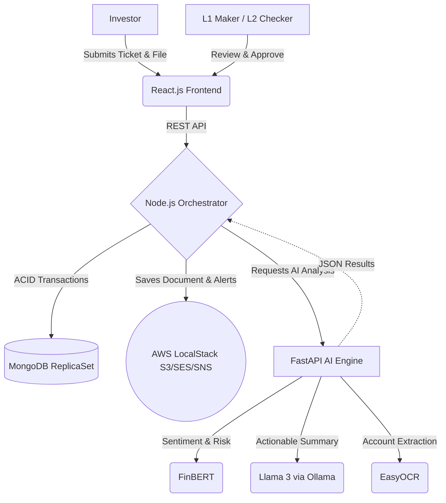

# 🚀 KFintech Nexus: AI-Powered Grievance Resolution & Compliance Portal

[](https://opensource.org/licenses/MIT)
[](https://www.docker.com/)
[](https://reactjs.org/)
[](https://nodejs.org/)
[](https://www.python.org/)
[](https://fastapi.tiangolo.com/)

## 🏆 The Business Problem We Solve
Financial institutions process millions of unstructured investor grievances annually. These tickets are often long, emotional, and include low-quality document attachments. Manual processing leads to:
- **High Turnaround Times (TAT):** Agents spend 70% of their time just reading and categorizing.
- **Compliance Risks:** Severe threats (e.g., legal action) get buried in the queue.
- **Human Error:** Manual verification of attached documents is slow and prone to mistakes.

## 💡 The Nexus Solution
Welcome to **KFintech Nexus**, an enterprise-grade, AI-driven grievance management system designed to radically optimize operational efficiency and ensure strict regulatory compliance. 

Nexus securely orchestrates ticket creation, AI-powered sentiment analysis, LLM-driven summarization, automated document OCR verification, and a rigorous multi-tiered (L1/L2) administrative workflow.

### 🌟 High-Impact Capabilities
- **Intelligent Triage (FinBERT):** Instantly analyzes the sentiment of incoming complaints. Automatically calculates a **Frustration Index** and flags legal/threat language to escalate tickets to **CRITICAL** priority.
- **Automated Summarization (Llama 3 / Ollama):** Distills multi-paragraph, emotional complaints into 3 concise, actionable bullet points, reducing agent reading time by 80%.
- **Zero-Touch Document Verification (EasyOCR):** Automatically scans uploaded KYC/supporting documents (even noisy/blurry ones) and fuzzy-matches extracted account numbers against the claim.
- **Strict Compliance Workflows:** Enforces Maker-Checker (L1/L2) governance via ACID-compliant MongoDB transactions, ensuring no single actor can approve sensitive resolutions.
- **Enterprise Notification Engine:** Integrates with AWS SES (Email) and SNS (SMS) for real-time investor updates (simulated via LocalStack for zero-cost deployment).

---

## 🏗️ Enterprise Architecture

Nexus is built on a modern, decoupled microservices architecture.



### Technology Stack
- **Frontend:** React.js (Vite), TailwindCSS, Glassmorphic UI design for an unparalleled enterprise UX.
- **Backend Orchestrator:** Node.js, Express.js, AWS SDK v3.
- **Database:** MongoDB configured as a ReplicaSet to support complex, rollback-safe transactions.
- **AI Microservice:** Python, FastAPI, PyTorch (CUDA-accelerated), HuggingFace Transformers.
- **Infrastructure:** Fully containerized via Docker Compose, utilizing LocalStack for local, cost-free AWS emulation.

---

## 🚀 Deployment & Setup

We use Docker Compose to completely containerize the application. **You do not need an AWS account, nor do you need to manually install Python, CUDA, or Node.**

### 🖥️ Minimum System Requirements
Due to the heavy on-premise AI models (Llama 3, FinBERT, PyTorch CUDA), the system requires:
- **Free Disk Space:** Minimum **30 GB** (Images + Model Weights)
- **RAM:** Minimum 8 GB (16 GB Recommended)
- **GPU (Optional but Recommended):** 4 GB VRAM (RTX 2050 or higher) for hardware-accelerated OCR and NLP inference.

### Prerequisites
1. [Docker Desktop](https://www.docker.com/products/docker-desktop) installed and running.
2. Ensure ports `5173` (Frontend), `5000` (Node), `8000` (Python AI), `27018` (MongoDB), `11434` (Ollama), and `4566` (LocalStack) are available.

### Option A: High-Performance GPU Mode (Recommended)
Utilizes NVIDIA CUDA for near-instant AI inference (FinBERT & OCR).
```bash
docker-compose up --build -d
```

### Option B: CPU Mode
If you do not have a dedicated NVIDIA GPU:
```bash
docker-compose -f docker-compose.cpu.yml up --build -d
```

---

## 🧪 Experience the Workflow

1. **Access the Portal:** Navigate to `http://localhost:5173`.
2. **Submit a Grievance (Investor View):**
   - Enter a complex, multi-issue complaint.
   - Attach a document containing an account number.
   - *Nexus immediately processes the text and extracts the document data.*
3. **Review & Triage (L1 Maker):**
   - Log in to the **L1 Maker Desk**.
   - See the AI-generated 3-bullet summary, the Frustration Index, and the automated OCR match status.
   - Escalate to L2.
4. **Final Approval (L2 Checker):**
   - Log in to the **L2 Checker Desk**.
   - Approve the resolution.
   - *Nexus automatically dispatches AWS SES (Email) and SNS (SMS) alerts to the investor.*

---

## 📈 Business Impact Metrics (Target)
- **80% Reduction** in average handle time (AHT) per ticket.
- **100% Identification** of severe/legal threats before human review.
- **Zero-Cost Prototyping** leveraging open-source LLMs (Llama 3) and LocalStack.
- **100% Audit Compliance** via immutable Maker-Checker logs.

## 🛑 Teardown
```bash
docker-compose down
# OR for CPU: docker-compose -f docker-compose.cpu.yml down
```
