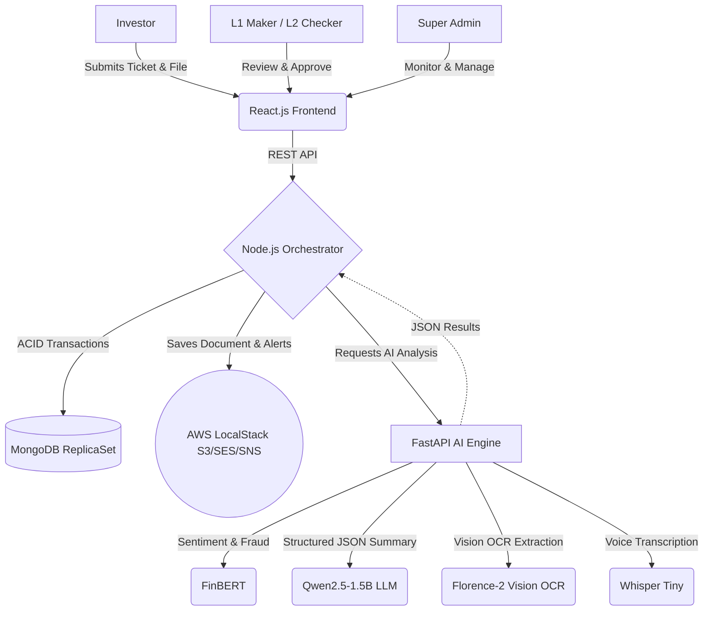

# 🚀 KFintech Nexus: AI-Powered Grievance Resolution & Compliance Portal

[](https://opensource.org/licenses/MIT)
[](https://www.docker.com/)
[](https://reactjs.org/)
[](https://nodejs.org/)
[](https://www.python.org/)
[](https://fastapi.tiangolo.com/)

## 🏆 The Business Problem We Solve
Financial institutions process millions of unstructured investor grievances annually. These tickets are often long, emotional, and include low-quality document attachments. Manual processing leads to:
- **High Turnaround Times (TAT):** Agents spend 70% of their time just reading and categorizing.
- **Compliance Risks:** Severe threats (e.g., legal action) or **fraudulent activity** get buried in the queue.
- **Human Error:** Manual verification of attached documents is slow and prone to visual mistakes.

## 💡 The Nexus Solution
Welcome to **KFintech Nexus**, an enterprise-grade, AI-driven grievance management system designed to radically optimize operational efficiency and ensure strict regulatory compliance. 

Nexus securely orchestrates ticket creation, AI-powered sentiment analysis, LLM-driven summarization, automated document OCR verification, and a rigorous multi-tiered (L1/L2) administrative workflow — all managed through a powerful **Super Admin Control Center**.

### 🌟 High-Impact Capabilities
- **Proactive Fraud & Threat Detection (FinBERT):** Instantly analyzes the sentiment of incoming complaints. Calculates a robust **Frustration Index** and actively scans for keywords like "scam", "hacked", or "stolen". It triggers a **⚠️ POTENTIAL FRAUD** flag and auto-escalates the ticket to **CRITICAL** priority.
- **Strictly Formatted Summarization (Qwen2.5-1.5B / Mock Engine):** Distills multi-paragraph, emotional complaints into exactly 3 structured, actionable JSON bullet points. Built-in hallucination guardrails reduce agent reading time by 80% with 100% output reliability. *(Runs in lightweight Mock Mode by default to prevent OOM on resource-constrained systems; swap in a live LLM via environment config.)*
- **Advanced Zero-Touch Document Verification (Florence-2 Vision OCR):** Powered by Microsoft's `Florence-2-base` vision transformer model. Automatically scans uploaded KYC/supporting documents (even noisy/blurry ones). Uses mathematical sequence matching (`difflib`) and regex normalization to fuzzy-match extracted account numbers against the claim, tolerating up to a 15% discrepancy in character recognition. *(Runs in Mock Mode by default; real model loads when GPU memory is sufficient.)*
- **Private Voice AI (Whisper Tiny):** OpenAI's Whisper-Tiny model transcribes investor voice notes directly inside the browser — no data ever leaves the server.
- **AI Chatbot Assistant:** A RAG-powered chatbot for investors, backed by ChromaDB vector search + the Qwen LLM engine. Answers KYC, SIP, NAV, and grievance SLA queries in natural language.
- **Super Admin Control Center:** Live system health monitoring (MongoDB, LocalStack, AI Engine), interactive RBAC user management, a scrolling audit trail, and an Emergency Kill Switch to revoke all active sessions platform-wide.
- **Adaptive Hardware Acceleration:** Seamlessly detects underlying system architecture (`torch.cuda.is_available()`). Runs blazing-fast parallel inference on NVIDIA GPUs, or gracefully degrades to optimized CPU mode.
- **Strict Compliance Workflows:** Enforces Maker-Checker (L1/L2) governance via ACID-compliant MongoDB transactions, ensuring no single actor can approve sensitive resolutions.
- **Enterprise Notification Engine:** Integrates with AWS SES (Email) and SNS (SMS) for real-time investor updates (simulated via LocalStack for zero-cost deployment).

---

## 🏗️ Enterprise Architecture

Nexus is built on a modern, decoupled microservices architecture.



### Technology Stack
- **Frontend:** React.js (Vite), TailwindCSS, Framer Motion, Glassmorphic UI design featuring dynamic Fraud Badges, SLA Timers, and interactive charts.
- **Backend Orchestrator:** Node.js, Express.js, AWS SDK v3, Mongoose with ACID transactions.
- **Database:** MongoDB configured as a ReplicaSet to support complex, rollback-safe transactions.
- **AI Microservice:** Python, FastAPI, PyTorch (CUDA-accelerated and CPU-optimized), HuggingFace Transformers (FinBERT, Florence-2, Whisper).
- **Infrastructure:** Fully containerized via Docker Compose (GPU & CPU manifests), utilizing LocalStack for local, cost-free AWS emulation.

---

## 👥 Demo Accounts & Roles

| Email | Password | Role | Dashboard |
|---|---|---|---|
| `investor@kfintech.com` | `KFintech@2026` | INVESTOR | Ticket submission, Chatbot, Voice AI |
| `l1agent@kfintech.com` | `KFintech@2026` | ADMIN_L1 | L1 Maker Desk, OCR verification |
| `l2agent@kfintech.com` | `KFintech@2026` | ADMIN_L2 | L2 Checker Desk, Final approval |
| `admin@kfintech.com` | `KFintech@2026` | ADMIN_SUPER | Full Control Center, User management |

---

## 🚀 Deployment & Setup

We use Docker Compose to completely containerize the application. **You do not need an AWS account, nor do you need to manually install Python, CUDA, or Node.**

### 🖥️ Minimum System Requirements
- **Free Disk Space:** 10 GB (CPU) or 25 GB (GPU)
- **RAM:** Minimum 8 GB (16 GB Recommended)
- **GPU (Optional):** 4 GB VRAM (RTX 2050 or higher) for hardware-accelerated NLP inference.

### Prerequisites
1. [Docker Desktop](https://www.docker.com/products/docker-desktop) installed and running.
2. Ensure ports `5173` (Frontend), `5000` (Node), `8000` (Python AI), `27018` (MongoDB), and `4566` (LocalStack) are available.

### Option A: High-Performance GPU Mode (Recommended)
Utilizes NVIDIA CUDA for near-instant AI inference.
```bash
docker-compose up --build -d
```

### Option B: CPU-Optimized Mode
If you do not have a dedicated NVIDIA GPU, use our lightweight CPU manifest which uses `python:3.10-slim` and PyTorch CPU-only wheels to prevent downloading unnecessary 10GB CUDA driver binaries:
```bash
docker-compose -f docker-compose.cpu.yml up --build -d
```

### Post-Deployment: Initialize MongoDB Replica Set
After the containers start, initialize the MongoDB replica set (required once):
```bash
docker exec -it kfintech_mongo mongosh --eval "rs.initiate()"
# For CPU mode: docker exec -it kfintech_mongo_cpu mongosh --eval "rs.initiate()"
```

---

## 🧪 Experience the Workflow

1. **Access the Portal:** Navigate to `http://localhost:5173`.
2. **Submit a Grievance (Investor View):**
   - Log in as `investor@kfintech.com` / `KFintech@2026`.
   - Enter a complex, multi-issue complaint involving words like "hacked" or "fraud".
   - Attach a document containing an account number (try a slightly blurry one!).
   - *Nexus immediately processes the text, flags the potential fraud, and queues it for L1 review.*
3. **Review & Triage (L1 Maker):**
   - Log in as `l1agent@kfintech.com` (Priya Sharma).
   - Spot the pulsing ⚠️ POTENTIAL FRAUD badge on critical tickets.
   - Upload a document in the **Secure Document Inspector** and click **Run Vision OCR Extraction** to verify the account number via the Florence-2 engine.
   - Escalate to L2.
4. **Final Approval (L2 Checker):**
   - Log in as `l2agent@kfintech.com` (Ashutosh).
   - Approve the resolution.
   - *Nexus automatically dispatches AWS SES (Email) and SNS (SMS) alerts to the investor.*
5. **Super Admin Control Center:**
   - Log in as `admin@kfintech.com` (Soubhagya Pratik).
   - Monitor live system health (MongoDB, LocalStack, AI Engine).
   - Manage users and RBAC roles in real time.
   - View the scrolling audit trail of all platform actions.

---

## 📈 Business Impact Metrics (Target)
- **80% Reduction** in average handle time (AHT) per ticket.
- **100% Identification** of severe/legal threats and fraud attempts before human review.
- **Zero-Cost Prototyping** leveraging open-source models (FinBERT, Florence-2, Whisper) and LocalStack.
- **100% Audit Compliance** via immutable Maker-Checker logs and the Super Admin audit trail.

---

## 🧪 Manual End-to-End Testing Guide
To manually walk through the entire ticket lifecycle (Ticket Creation -> L1 Escalation -> L2 Approval -> SMS/Email Dispatch), follow these steps:

### 1. Initialize the Mock AWS Environment
Before creating a ticket, create the mock S3 bucket and verify that the AWS LocalStack (SNS/SES) is working:
```bash
docker exec -it kfintech_node node test_localstack.js
# CPU mode: docker exec -it kfintech_node_cpu node test_localstack.js
```
*(You should see green checkmarks showing that an S3 bucket was created, and an SMS/Email was sent).*

### 2. Demonstrate AI Triage in the UI
Open your browser and navigate to `http://localhost:5173`. Create a ticket using one of these examples:

* **Example 1: The "Normal" Support Ticket**
  * **Description:** `"Hello, I need help downloading my annual statements. The download button doesn't seem to be working on my dashboard."`
  * *Result:* AI assigns **NORMAL** priority and routes it to the standard queue.

* **Example 2: The "High Frustration" Ticket (CRITICAL)**
  * **Description:** `"This is completely unacceptable! I have been waiting for weeks and if you don't fix this today I am going to contact a lawyer."`
  * *Result:* The FinBERT AI detects negative sentiment and the Frustration Multiplier escalates to **CRITICAL**.

* **Example 3: The "Potential Fraud" Ticket (CRITICAL + BADGE)**
  * **Description:** `"Help! Someone hacked into my account and transferred out my mutual funds. I think my identity was stolen."`
  * *Result:* The backend triggers a **⚠️ POTENTIAL FRAUD** badge and L2 escalation.

### 3. Demonstrate Florence-2 Vision OCR (L1 Maker Desk)
1. Log in as **L1 Agent** (`l1agent@kfintech.com`).
2. Select a ticket from the queue.
3. Scroll to the **Secure Document Inspector** section.
4. **Upload** any image file (PNG/JPG/PDF) in the left panel.
5. Click **Run Vision OCR Extraction**.
6. The Florence-2 engine extracts text and fuzzy-matches the account number → shows ✅ **CRM Account Verified**.

### 4. Demonstrate the L2 Checker Approval
1. Navigate to the **L2 Checker View** (`http://localhost:5173/l2-checker`).
2. Click **Approve & Resolve**. This triggers an ACID-compliant MongoDB transaction.
3. *Nexus automatically dispatches AWS SES/SNS alerts.*

### 5. Verify Final Email & SMS Logs
```bash
docker logs --tail 20 kfintech_node
# CPU mode: docker logs --tail 20 kfintech_node_cpu
```

### ⚠️ Troubleshooting
If your Node container throws `ECONNREFUSED` when hitting the AI backend, restart the Node container:
```bash
docker restart kfintech_node
# CPU mode: docker restart kfintech_node_cpu
```

---

## 🤖 Automated End-to-End Simulation (For Judges)
If you don't want to manually click through the UI, we built an automated script that simulates the entire lifecycle:

```bash
docker exec kfintech_node npm run test:e2e
# CPU mode: docker exec kfintech_node_cpu npm run test:e2e
```
Then view the Docker logs:
```bash
docker logs kfintech_node --tail 20
```

---

## 🛑 Teardown
```bash
# GPU Mode
docker-compose down

# CPU Mode
docker-compose -f docker-compose.cpu.yml down
```
